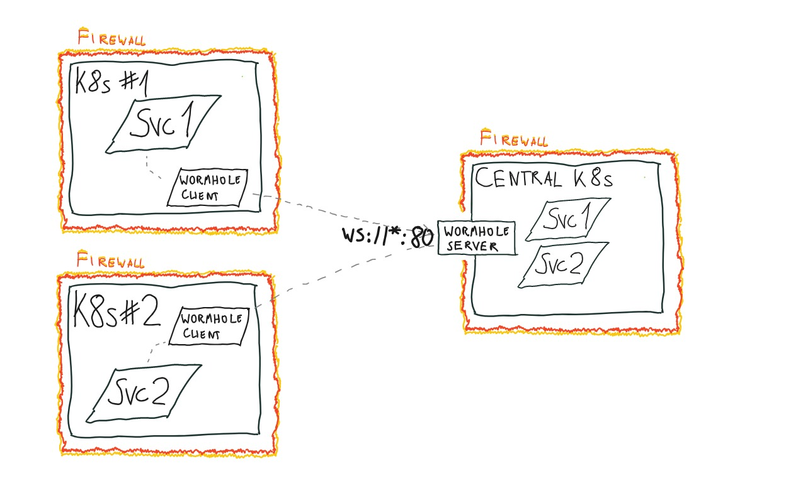

# Wormhole

Wireguard + Nginx Stream (L4)  reverse TCP tunnels over wireguard, similar to ngrok, teleport or skupper, but implemented specifically for Kubernetes. Mostly a learning project. Allows exposing services from one Kubernetes cluster to another just by annotating them.

Wormhole is implemented using "Hub and spoke" architecture. One cluster acts as a central hub, while others are clients. Clients can expose services to the hub and the hub can expose services to the clients. Exposing of the services between the clients is **not supported**.

## Architecture

Wormhole uses a combination of three components in order to work:

* Wormhole controller - a Kubernetes controller that watches for services with a specific annotation and creates tunnels for them
* Bundled Nginx - a simple Nginx server that is dynamically configured to proxy requests to the tunnels and vice versa
* Wireguard - a VPN server that is used to create secure tunnels between the clusters, it's also dynamically configured by the controller

This repository contains source code for all of the components.



### Peering

Peering is the process of establishing a connection between two clusters. The peering is performed outside of the tunnel, using the HTTP API exposed by the server over the public internet. The peering by default is performed using HTTP protocol, but you may put the server behind SSL-terminating reverse proxy. Saying that, the communication is encrypted using a PSK, that both the client and server must know prior to the peering. The communication goes as follows.

* Operator deploys the server and client, configuring them with the same PSK, for example `supersecret`
* Upon startup, the client continuously tries to connect to the server using the HTTP API, encrypting the payload of the request with the PSK
* The server knowing the PSK, decrypts the payload and checks if the client is allowed to connect. If it's not able to decrypt the payload, it means that the client doesn't know the PSK and the connection is rejected.
* The peering message looks something like this (of course as stated above it's encrypted):
    * `{"name": "client1", "wireguard": {"public_key": "xyz...xyz"}, "metadata": {}}`
* The server checks if declared name matches the public key (if there were previous successful peerings) or creates a new client with the given name and public key. It also updates its Wireguard configuration with the new client and responds with something like this (of course encrypted):
    * `{"name": "server", "wireguard": {"public_key": "abc...abc"}, "metadata": {}, "assigned_ip": "192.168.11.6", "internal_server_ip": "192.168.11.1"}`
    * The response is similar, but contains also the server's public key, assigned IP for the client, and the server's internal (VPN) IP address.
* The client updates its Wireguard configuration with the server's public key and the assigned IP, and starts the Wireguard tunnel. The tunnel is now established and the client can communicate with the server.

### Syncing

Syncing is a process of exchanging information about exposed applications on both client and server. The syncing is performed over the Wireguard tunnel, so it's secure. The syncing goes as follows:
* Both client and server observe the state of kubernetes services deployed on their respective clusters. If a service is annotated with `wormhole.glothriel.github.com/exposed=yes`, it's considered exposed and added to internal exposed apps registry.
* Every 5 (configurable) seconds, the client performs a HTTP request over the wireguard tunnel to the server, sending the list of exposed services. It looks like this:
    * `{"peer": "client1", "apps": [{"name": "nginx", "address": "192.168.1.6:25001", "original_port" :80}]}`
* The response from the server is exactly the same, but contains the list of exposed services on the server side. The client updates its internal registry with the server's exposed services, both create nginx proxies and respective kubernetes services for the apps exposed by the opposite side.


## Usage

You can install wormhole using helm. For server you will need a cluster with LoadBalancer support, for client - any cluster. IP exposed by the server's LoadBalancer must be reachable from the client's cluster.

You can optionally install both the server and the client on the same cluster and use ClusterIP service for communication. See the [./Tiltfile](./Tiltfile) for an example, as the development environment uses this approach.

### Install server

Server is a central component of wormhole. It allows clients to connect and hosts the tunnels. It exposes two services:

* HTTP API for peering (initial peering is performed outside of the tunnel)
* Wireguard server for tunnel

If you'll use DNS, you can install the server in one step (replace 0.0.0.0 with the public hostname), otherwise you'll have to wait for the LoadBalancer to get an IP and update configuration after that.

```
kubectl create namespace wormhole

LATEST_VERSION=$(curl -s https://api.github.com/repos/glothriel/wormhole/releases/latest | grep -Po '"tag_name": "\K.*?(?=")')

echo "Latest version is $LATEST_VERSION"

# Replace 1.0.0 with latest version from the releases page
helm install -n wormhole wh oci://ghcr.io/glothriel/wormhole/wormhole --version $LATEST_VERSION --set server.enabled=true --set server.service.type=LoadBalancer --set server.wg.publicHost="0.0.0.0"

# Wait for the LoadBalancer to get an IP
kubectl get svc -n wormhole

# Update the server with the IP
helm upgrade -n wormhole wh oci://ghcr.io/glothriel/wormhole/wormhole --version $LATEST_VERSION --reuse-values --set server.wg.publicHost="<the new IP>"
```

### Install client

You should do this on another cluster. If not, change the namespace to say `wormhole-client` to avoid conflicts. Please note the `client.name` parameter - it should be unique for each client. At this point you may add as many clients as you want.

```
kubectl create namespace wormhole

helm install -n wormhole wh kubernetes/helm --set client.enabled=true --set client.serverDsn="http://<server.wg.publicHost>:8080" --set client.name=client-one
```

### Expose a service

Now you can expose a service from one infrastructure to another. Services exposed from the server will be available on all the clients. Services exposed from the client will be available only on the server.

```
kubectl annotate --overwrite svc --namespace <namespace> <service> wormhole.glothriel.github.com/exposed=yes
```

After up to 30 seconds the service will be available on the other side.

### Customize the exposed services

You can use two additional annotations to customize how the service is exposed on the other side:

```
# Customize the service name
wormhole.glothriel.github.com/name=my-custom-name

# If the service uses more than one port, you can specify which ports should be exposed
wormhole.glothriel.github.com/ports=http
wormhole.glothriel.github.com/ports=80,443
```

### Enable creation of network policies

You can secure the services exposed on another end by configuring network policies. Network policies are currently implemented on a per-peer basis, so for example a client may have them enabled and the server may not, or only a subset of clients may have them enabled.

You can enable network policies by setting `--set networkPolicies.enabled=true` helm chart value. Network policies of course in order to work require the cluster that supports them.

When wormhole is deployed with network policies support, each time it exposes a remote service it also creates a matching network policy. The network policy is created in the same namespace as the service and allows filtering of the traffic from other workloads in the cluster to the remote service.

```
apiVersion: networking.k8s.io/v1
kind: NetworkPolicy
metadata:
    ...
spec:
    ingress:
    - from:
        - namespaceSelector: {}
            podSelector:
                matchLabels:
                    wormhole.glothriel.github.com/network-policy-consumes-app: <<APP-NAME>>
        ports:
        - port: 25001
            protocol: TCP
    podSelector:
        matchLabels:
            application: wormhole-client-dev1
    policyTypes:
    - Ingress
```

Such policies allow communication from any pod in any namespace, providing, that the pod that tries to communicate has a label `wormhole.glothriel.github.com/network-policy-consumes-app` with the value of the name of the service that is exposed. The app name (unless override by `wormhole.glothriel.github.com/name=my-custom-name`) is `<service-namespace-name>-<service-name>` (for example `default-nginx`) of the service exposed from remote cluster.

Effectively this means, that the permission to communicate is granted per application, not per peer. Having permission to communicate with app having given name, allows the pod to communicate with all the apps with given name, no matter the peer the app is exposed from. This is especially important in the context of the server, as it may have multiple clients, all exposing the same app.

## HTTP API

Wormhole exposes API, that allows querying apps exposed by remote apps. The API does not require authentication. The API by default listens on port 8082.

### GET /api/apps/v1

This endpoint returns the list of apps exposed locally by the remote apps.

#### Request

No body or query parameters are required.

#### Response

| Property | Required |  Type | Description |
|:---------|:---------|:-----|:------------|
| **name** | yes | String | Name of the exposed app |
| **address**   | yes      | String | `{hostname}:{port}` of the app exposed on the local cluster |
| **peer**   | yes      | String | Name of the remote peer, that exposed the app |


| Code | Description |
|:-----|:------------|
|200 Ok | Returned when request was successful |
|500 Internal server error | Returned when the apps could not be fetched for unknown reasons. |

### GET /api/peers/v1

This endpoint is only available on the server. It returns the list of remote peers that are connected to the server.

#### Request

No body or query parameters are required.

#### Response

| Property | Required |  Type | Description |
|:---------|:---------|:-----|:------------|
| **name** | yes | String | Name of the remote peer |
| **ip**   | yes      | String | IP of the peer in wireguard network |
| **public_key**   | yes      | String | Wireguard public key of the peer |


| Code | Description |
|:-----|:------------|
|200 Ok | Returned when request was successful |
|500 Internal server error | Returned when the peers could not be fetched for unknown reasons. |

### DELETE /api/peers/v1/{name}

This endpoint is only available on the server. It allows removing a peer from the server. The peer will be disconnected and all the apps exposed by the peer will be removed.

#### Request

No body or query parameters are required.

#### Response

| Code | Description |
|:-----|:------------|
|204 No content | Returned when request was successful |
|500 Internal server error | Returned when the peer could not be deleted from unknown reason. |

## Local development

### Development environment

Requirements:

* Helm
* Tilt
* K3d

```
k3d cluster create wormhole --registry-create wormhole

tilt up
```

First start of wormhole will be really slow - it compiles the go code inside the container. Subsequent starts will be faster, as the go build cache is preserved in PVC.

The development environment deploys a server, two clients and a mock service, that you can use to test the tunnels.

```
kubectl annotate --overwrite svc --namespace nginx nginx  wormhole.glothriel.github.com/exposed=yes
```

The additional services should be immediately created. Please note, that all three workloads are deployed on the same cluster (and by extension are monitoring the same services for annotations), so the nginx will be exposed 4 times - client1 to server, client2 to server, server to client1 and server to client2.

### Integration tests

```
cd tests && python setup.py develop && cd -

pytest tests
```

If you are re-running the tests multiple times, you may want to reuse the K3d cluster, you can do this by setting the `REUSE_CLUSTER` environment variable to a truthy value. It will then abstain from removing the cluster after the tests are done and reuse it for the next run.

```
export REUSE_CLUSTER=1
pytest tests
```