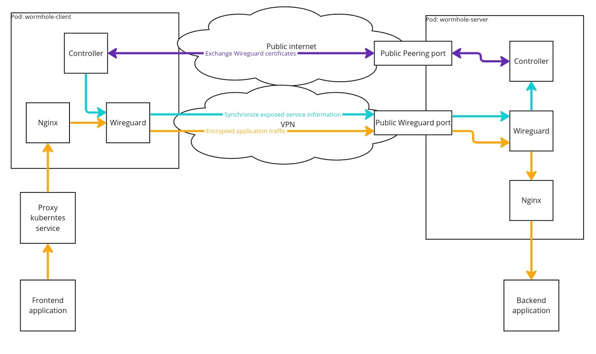

# Wormhole

L7 reverse tunnels over websocket, similar to ngrok, teleport or skupper, but implemented specifically for Kubernetes. Mostly a learning project. Allows exposing services from one Kubernetes cluster to another just by annotating them.



## What should I use this for?

To be honest, currently you should consider using something like Gravitational Teleport or Hashicorp Boundary. This project was started, because I was not satisfied with Teleport, due to:
* Connection errors and the need of manual re-connecting the nodes
* The sockets on Teleport side are protected with SSL, even though my central K8s cluster is trusted
* Authorization model with invite tokens, that make onboarding new edge infrastructures harder
* No plug-in integration with kubernetes like wormhole has (just annotate the service and it's automatically mirrored on central cluster)

Boundary, when I evaluated it, didn't support reverse tunnels (expected port to be opened on edge infras), so it was out of question.

## Helm

You can install wormhole using helm. Please clone this repository first.

### Install server

Server must expose port (container port 8080) for the clients that will be creating reverse tunnels. The port may be exposed directly with service type LoadBalancer (set `server.service.type` to `LoadBalancer`), or you can put wormhole behind Ingress Controller (tested with HAProxy), as it's basically a websocket server. In that case, you need to provide your Ingress resource yourself.

```
kubectl create namespace wormhole-server
helm install -n wormhole-server whserver kubernetes/helm --set server.enabled=true
```

### Install client

This command allows installing client in the same cluster as server, for testing purposes. If you'd like to deploy client in other cluster, please adjust `client.serverDsn`.

```
kubectl create namespace wormhole-client
helm install -n wormhole-client wormhole-client kubernetes/helm --set client.name=testclient --set client.enabled=true --set client.serverDsn=ws://wormhole-whserver-server.wormhole-server:8080
```
